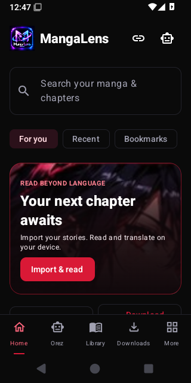
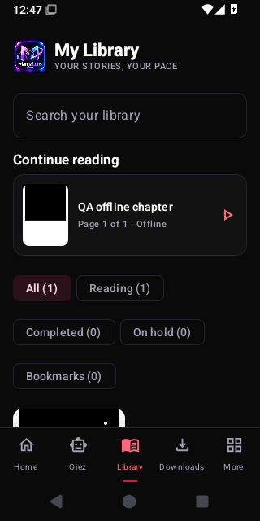
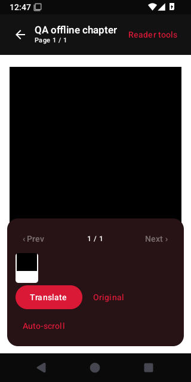
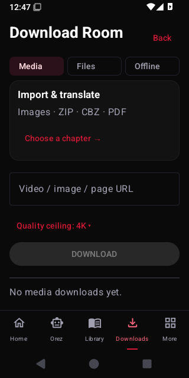
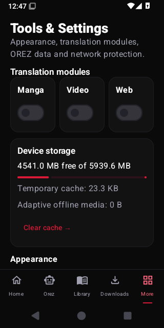
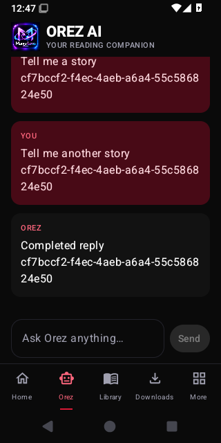
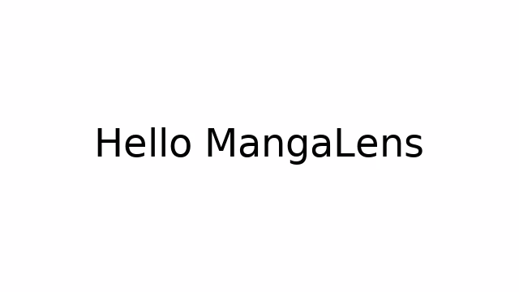

# Actual Android screenshots

Captured in successful [CI run 37202813493](https://github.com/RezoxNemesis/MangaLens/actions/runs/37202813493), app source `de70357`. [Pass/fail report](../QA_FEATURE_RESULTS.md).

These are original screenshots and renderer outputs. **The chapter and video shown here are generated QA fixtures, not your uploaded samples.** The separate private-sample failures and unverified checks are listed in the report.

## Home

## Library

## Reader — generated offline QA chapter
The black rectangle is deliberately drawn in the fixture page; it is not a missing chapter image.

## Downloads

## Settings

## Orez AI — chat cancellation fixture
The displayed fixture reply verifies cancellation/recovery UI. Real native model inference was tested separately.

## Synthetic replacement lettering — before

## Synthetic replacement lettering — after
The English source is erased and the Hindi text fits the same paper region; the red artwork stays unchanged.

## Captured generated video frame — OCR fixture
This is actual Android decoded-frame capture of a generated fixture, not the supplied 23.52-second video.

